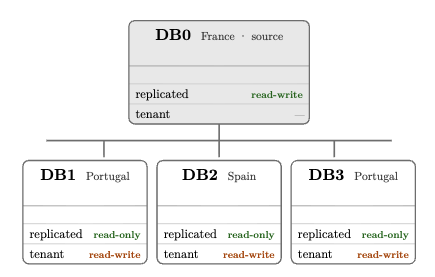

# Objective

Turn a data replication problem in a distributed environment into a formal model, describing the topology, the consistency model, and the constraints under which replication must operate based on a given context. The goal is to build a clear understanding of the challenges involved in replicating data across distributed databases and to provide a foundation for discussing potential solutions.

This raises a few challenges, such as inserting, updating, and deleting data with foreign keys, based on [Foreign Key Constraints to Maintain Referential Integrity in Distributed Database in Microservices Architecture](https://thesai.org/Publications/ViewPaper?Volume=16&Issue=6&Code=IJACSA&SerialNo=96).

Throughout the process, I'll add other relevant academic and technical references to the problem, to provide broader context and ground the modeling decisions.

# Context

Based on a real scenario of databases distributed by tenants, where each tenant has a local database, but there's a need to replicate some system configuration tables from a central database (DB0) to the tenants' databases (DB1, DB2, DB3).

Each database needs to have a copy of this information, so the system can work in a distributed and independent way.

The paper may be published on ResearchGate, but without academic weight, so the focus is more on clarity and on describing the problem than on rigorous formalisms.
